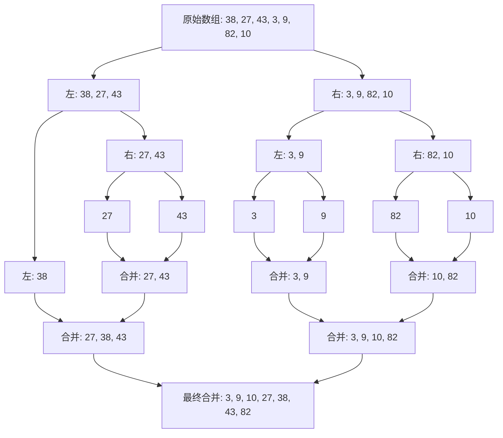

当然！归并排序是一种非常经典且高效的排序算法，它完美体现了“**分而治之**”的核心思想。

### 一、核心思想：分而治之

归并排序的流程可以简单概括为三个步骤：

1. **分**：将一个大问题递归地分解成若干个小的、易于解决的子问题。
    
2. **治**：解决这些最小的子问题。
    
3. **合**：将已解决的子问题的结果合并起来，得到原问题的解。
    

对于排序来说，“治”就是排序最小的单元（一个或两个元素），“合”就是将两个已经排好序的数组合并成一个新的有序数组。

---

### 二、工作原理详解

我们用一个数组来演示：`[38, 27, 43, 3, 9, 82, 10]`

#### 第1步：分解

不断地将数组从中间拆分成两半，直到每个子数组只剩下一个元素（一个元素本身就被视为是有序的）。

```
原始数组: [38, 27, 43, 3, 9, 82, 10]
第一次拆分: [38, 27, 43] 和 [3, 9, 82, 10]
第二次拆分: [38] [27, 43] 和 [3, 9] [82, 10]
第三次拆分: [38] [27] [43] 和 [3] [9] [82] [10]
```

现在，我们得到了7个只有一个元素的子数组：`[38]`, `[27]`, `[43]`, `[3]`, `[9]`, `[82]`, `[10]`。每个都是有序的。

#### 第2步：合并与排序

这是归并排序的精华所在。我们开始“归并”，也就是将两个有序数组合并成一个新的有序数组。

**合并两个有序数组的技巧**：

- 比较两个数组的**第一个元素**。
    
- 将**较小的那个**取出，放入新数组。
    
- 重复上述步骤，直到其中一个数组为空。
    
- 将另一个数组剩余的元素全部追加到新数组的末尾。
    

**让我们一步步合并：**

1. **合并 `[27]`和 `[43]`**：
    
    - 比较27和43，27更小，新数组为 `[27]`，然后只剩下 `[43]`，最终得到 `[27, 43]`。
        
    
2. **合并 `[38]`和 `[27, 43]`**：
    
    - 比较38和27，27更小，新数组为 `[27]`。
        
    - 比较38和43，38更小，新数组为 `[27, 38]`。
        
    - 第一个数组已空，将 `[43]`加入，得到 `[27, 38, 43]`。
        
    
3. **另一边，合并 `[3]`和 `[9]`**： 得到 `[3, 9]`。
    
4. **合并 `[82]`和 `[10]`**：
    
    - 比较82和10，10更小，新数组为 `[10]`，然后只剩下 `[82]`，最终得到 `[10, 82]`。
        
    
5. **合并 `[3, 9]`和 `[10, 82]`**：
    
    - 比较3和10，3更小 -> `[3]`
        
    - 比较9和10，9更小 -> `[3, 9]`
        
    - 第一个数组已空，将 `[10, 82]`加入，得到 `[3, 9, 10, 82]`。
        
    
6. **最后，合并两个大数组 `[27, 38, 43]`和 `[3, 9, 10, 82]`**：
    
    - 不断比较两个数组的首元素：27 vs 3 -> 取3；27 vs 9 -> 取9；27 vs 10 -> 取10；27 vs 82 -> 取27；38 vs 82 -> 取38；43 vs 82 -> 取43；最后追加82。
        
    - 最终得到完整的有序数组：`[3, 9, 10, 27, 38, 43, 82]`。
        
    

整个过程可以可视化为一棵树：



---

### 三、核心特点

1. **稳定性**：归并排序是一种**稳定排序**。如果两个元素相等，在合并过程中，我们会优先取左边数组的元素，从而保证它们原有的相对顺序不变。
    
2. **时间复杂度**：无论是最好、最坏还是平均情况，其时间复杂度都是 **O(n log n)**。这是比较排序算法中非常高效的一类。
    
3. **空间复杂度**：归并排序不是**原地排序**，它需要额外的空间（O(n)）来存储合并过程中的临时数组。这是它的一个主要缺点。
    
4. **适用性**：特别适合用于**排序链表**（可以优化空间复杂度为O(1)）和**外部排序**（当数据量太大无法全部加载到内存时，比如MapReduce中的Shuffle阶段就使用了类似归并排序的方法对磁盘上的数据进行排序）。
    

## 四、python实现
```python
def merge_sort(arr):
    # pass
    if len(arr) <= 1:
        return arr
    mid = len(arr) // 2
    # 分而治之
    left = arr[:mid]
    right = arr[mid:]
    left = merge_sort(left)
    right = merge_sort(right)

    return merge(left,right)

def merge(left,right):
    tmp = []
    i,j = 0,0
    while i < len(left) and j < len(right):
        if left[i] <= right[j]:
            tmp.append(left[i])
            i += 1
        else:
            tmp.append(right[j])
            j += 1
    # 此时已经有一个集合为空了。
    # 将另一个数组(一定有序)的其他元素加到tmp结尾
    while i < len(left):
        tmp.append(left[i])
        i += 1

    while j < len(right):
        tmp.append(right[j])
        j += 1
    return tmp


if __name__ == "__main__":
    test_array = [38, 27, 43, 3, 9, 82, 10]
    print("排序前:", test_array)

    sorted_array = merge_sort(test_array)
    print("排序后:", sorted_array)
```

## 五、java实现

```java
import java.util.Arrays;

public class MergeSort {
    
    /**
     * 归并排序的公共接口
     */
    public static void mergeSort(int[] arr) {
        if (arr == null || arr.length <= 1) {
            return;
        }
        // 创建一个临时数组，避免在递归过程中反复创建
        int[] temp = new int[arr.length];
        mergeSort(arr, 0, arr.length - 1, temp);
    }
    
    /**
     * 递归排序函数
     * @param arr 原数组
     * @param left 左边界（包含）
     * @param right 右边界（包含）
     * @param temp 临时数组
     */
    private static void mergeSort(int[] arr, int left, int right, int[] temp) {
        // 递归基：当子数组只有一个元素时返回
        if (left >= right) {
            return;
        }
        
        // 1. 分：找到中间点
        int mid = left + (right - left) / 2; // 防止整数溢出
        
        // 递归排序左右两半
        mergeSort(arr, left, mid, temp);
        mergeSort(arr, mid + 1, right, temp);
        
        // 2. 合：合并两个有序子数组
        merge(arr, left, mid, right, temp);
    }
    
    /**
     * 合并两个有序子数组 arr[left...mid] 和 arr[mid+1...right]
     */
    private static void merge(int[] arr, int left, int mid, int right, int[] temp) {
        int i = left;      // 左半部分的起始索引
        int j = mid + 1;   // 右半部分的起始索引
        int k = left;      // 临时数组的当前索引
        
        // 比较两个子数组的元素，将较小的放入临时数组
        while (i <= mid && j <= right) {
            if (arr[i] <= arr[j]) {  // 保持稳定性
                temp[k++] = arr[i++];
            } else {
                temp[k++] = arr[j++];
            }
        }
        
        // 将左半部分剩余元素复制到临时数组
        while (i <= mid) {
            temp[k++] = arr[i++];
        }
        
        // 将右半部分剩余元素复制到临时数组
        while (j <= right) {
            temp[k++] = arr[j++];
        }
        
        // 将临时数组中合并后的数据复制回原数组
        for (int index = left; index <= right; index++) {
            arr[index] = temp[index];
        }
    }
    
    // 测试代码
    public static void main(String[] args) {
        int[] testArray = {38, 27, 43, 3, 9, 82, 10};
        System.out.println("排序前: " + Arrays.toString(testArray));
        
        mergeSort(testArray);
        System.out.println("排序后: " + Arrays.toString(testArray));
        
        // 输出：
        // 排序前: [38, 27, 43, 3, 9, 82, 10]
        // 排序后: [3, 9, 10, 27, 38, 43, 82]
    }
}
```

### 总结

归并排序通过 **“先分解，后合并”**​ 的方式，将一个复杂的排序问题转化为简单的合并问题。虽然它需要额外的存储空间，但其稳定且高效的 **O(n log n)**​ 性能使其在大量实际场景中都非常有用。