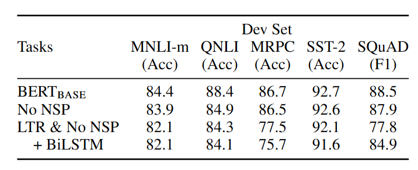
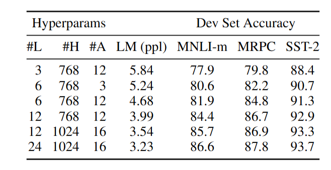
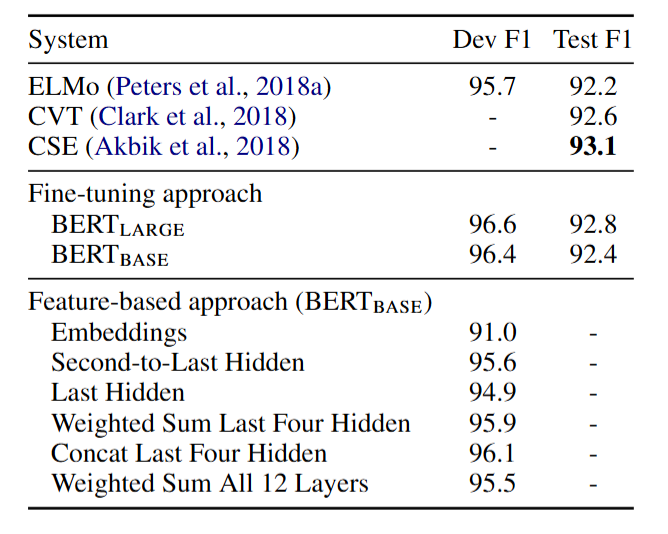

## 5 Ablation Studies

5 消融研究 

In this section, we perform ablation experiments over a number of facets(部分，方面) of BERT in order to better understand their relative importance. Additional  ablation studies can be found in Appendix C.

在本节中，我们对 BERT 的多个方面进行了消融实验，以便更好地理解它们的相对重要性。在附录 C 中可以找到更多的消融研究。 

> 消融实验（Ablation Study）是一种在研究中用于评估模型或系统中不同组件重要性的实验方法。 在自然语言处理等领域，以 BERT 模型的消融实验为例，其具体操作如下： 
>
> - **实验设计思路**：在保持其他条件尽可能相同的情况下，依次移除或修改模型的某些特定部分，如 BERT 中的某个预训练任务、某种网络结构或特定的损失函数组件等，然后观察模型在相同任务上的性能变化。 
> - **评估指标**：通常会采用如准确率、F1 值、困惑度等在相应任务中常用的评估指标来量化模型性能。例如在文本分类任务中，观察模型在去除某组件后的准确率下降情况；在语言建模任务中，关注困惑度的变化。 
> - **作用和意义**：通过消融实验，可以清晰地了解到模型各个组成部分对整体性能的贡献程度。比如，如果去除 BERT 的下一句预测任务后，模型在某些自然语言推理任务上的准确率大幅下降，就说明该任务对于模型在这些任务上的表现起到关键作用；若某个特定的网络层被移除后性能变化不大，则表明该层相对不那么重要，这有助于研究人员在模型设计和优化时决定保留或改进哪些部分，从而更高效地提升模型性能或简化模型结构。 

Table 5: Ablation over the pre-training tasks using the $BERT _{BASE }$ architecture. “No NSP” is trained without the next sentence prediction task. “LTR & No NSP” is trained as a left-to-right LM without the next sentence prediction, like OpenAI GPT. “+ BiLSTM” adds a randomly initialized BiLSTM on top of the “LTR + No $NSP$ model during fine-tuning.

表 5：使用$BERT_{BASE}$架构对预训练任务进行的消融实验。“无 NSP”是在没有下一句预测任务的情况下进行训练。“从左到右且无 NSP”像 OpenAI GPT 一样，作为一个从左到右的语言模型在没有下一句预测任务的情况下进行训练。“+BiLSTM”在微调期间于“从左到右且无 NSP”模型之上添加一个随机初始化的双向长短期记忆网络（BiLSTM）。 

### 5.1 Effect of Pre-training Tasks

We demonstrate the importance of the deep bidirectionality of BERT by evaluating two pretraining objectives using exactly the same pretraining data, fine-tuning scheme, and hyperparameters as $BERT _{BASE }$

我们通过使用与$BERT_{BASE}$完全相同的预训练数据、微调方案和超参数来评估两个预训练目标，从而证明了BERT深度双向性的重要性。 

**No NSP:** A bidirectional model which is trained using the “masked LM” (MLM) but without the “next sentence prediction” (NSP) task.

**LTR & No NSP:** A left-context-only model which is trained using a standard Left-to-Right (LTR) LM, rather than an MLM. The left-only constraint was also applied at fine-tuning, because removing it introduced a pre-train/fine-tune mismatch that degraded downstream performance. Additionally, this model was pre-trained without the NSP task. This is directly comparable to OpenAI GPT, but using our larger training dataset, our input representation, and our fine-tuning scheme.

**无 NSP：**一个使用“掩码语言模型”（MLM）训练但没有“下一句预测”（NSP）任务的双向模型。

**LTR & 无 NSP：**一个仅使用左上下文的模型，它使用标准的从左到右（LTR）语言模型而非 MLM 进行训练。**在微调时也应用了仅左上下文的限制，因为移除该限制会引入预训练/微调不匹配的问题，从而降低下游性能。**此外，该模型在预训练时没有 NSP 任务。这与 OpenAI GPT 直接可比，但使用了我们更大的训练数据集、输入表示和微调方案。 

We first examine the impact brought by the NSP task. In Table 5, we show that removing NSP hurts performance significantly on QNLI, MNLI, and SQuAD 1.1. Next, we evaluate the impact of training bidirectional representations by comparing “No NSP” to “LTR & No NSP”. The LTR model performs worse than the MLM model on all tasks, with large drops on MRPC and SQuAD.

我们首先研究了下一句预测（NSP）任务所带来的影响。在表 5 中，**我们表明移除 NSP 会显著降低在 QNLI、MNLI 和 SQuAD 1.1 上的性能。**

接下来，我们通过比较“无 NSP”和“从左到右且无 NSP”来评估训练双向表示的影响。**从左到右（LTR）模型在所有任务上的表现都比掩码语言模型（MLM）差，在 MRPC 和 SQuAD 上的性能下降幅度很大。** 

For SQuAD it is intuitively clear that a LTR model will perform poorly at token predictions, since the token-level hidden states have no rightside context. In order to make a good faith attempt at strengthening the LTR system, we added a randomly initialized BiLSTM on top. This does significantly improve results on SQuAD, but the results are still far worse than those of the pretrained bidirectional models. The BiLSTM hurts performance on the GLUE tasks. 

**对于 SQuAD 任务，直观上很明显，从左到右（LTR）模型在词元预测方面表现会很差，因为词元级隐藏状态没有右侧上下文。**为了切实尝试加强 LTR 系统，我们在其顶部添加了一个随机初始化的双向长短期记忆网络（BiLSTM）。这确实显著提高了 SQuAD 上的结果，但结果仍然远不如预训练的双向模型。而且 BiLSTM 还损害了在 GLUE 任务上的性能。

We recognize that it would also be possible to train separate LTR and RTL models and represent each token as the concatenation of the two models, as ELMo does. However: (a) this is twice as expensive as a single bidirectional model; (b) this is non-intuitive for tasks like QA, since the RTL model would not be able to condition the answer on the question; (c) this it is strictly less powerful than a deep bidirectional model, since it can use both left and right context at every layer.

 我们认识到，也可以像 ELMo 那样**分别训练 LTR 和 RTL（从右到左）模型，并将每个词元表示为这两个模型的连接。**然而：（a）这比单个双向模型的**成本要高**一倍；（b）对于问答（QA）等任务来说不直观，因为 RTL(右侧到左侧) 模型无法根据问题来确定答案；（c）这**严格来说不如深度双向模型强大**，因为深度双向模型在每一层都能同时使用左右上下文。 

总结

本文通过设置“No NSP”（仅用掩码语言模型训练的双向模型）和“LTR & No NSP”（仅用从左到右语言模型训练且无下一句预测任务的模型）两种模型，并采用与 BERT_BASE 相同的预训练数据、微调方案和超参数进行实验，研究了 BERT 深度双向性的重要性。

结果显示：

- 移除下一句预测任务会显著降低在 QNLI、MNLI 和 SQuAD 1.1 等任务上的性能，且从左到右模型在所有任务上表现均比掩码语言模型差，尤其在 MRPC 和 SQuAD 上下降幅度大。
- 在 SQuAD 任务中为加强从左到右模型添加随机初始化的双向长短期记忆网络虽有效果但仍远不如预训练双向模型且损害了 GLUE 任务性能。
- 此外还探讨了像 ELMo 那样分别训练左右向模型并连接的方式，指出其存在成本高、对问答任务不直观且不如深度双向模型强大等问题。 

### 5.2 Effect of Model Size

In this section, we explore the effect of model size on fine-tuning task accuracy. We trained a number of BERT models with a differing number of **layers, hidden units, and attention heads**, while otherwise using the same hyperparameters and training procedure as described previously.

在本节中，我们探究模型规模对微调任务准确性的影响。我们训练了一些具有不同层数、隐藏单元数量和注意力头数量的 BERT 模型，除此之外，使用与前文所述相同的超参数和训练流程。 

Results on selected GLUE tasks are shown in Table 6. In this table, we report the average Dev Set accuracy from 5 random restarts of fine-tuning. We can see that larger models lead to a strict accuracy improvement across all four datasets, even for MRPC which only has 3,600 labeled training examples, and is substantially(非常；大大地) different from the pre-training tasks. It is also perhaps surprising that we are able to achieve such significant improvements on top of(在…之上) models which are already quite large relative to the existing literature. For example, the largest Transformer explored in Vaswani et al.(2017) is( $L=6$ , $H=1024$ , $A=16$ ) with 100M parameters for the encoder, and the largest Transformer we have found in the literature is $L=64$ , $H=512$ , $A=2$ ) with 235M parameters (AI-Rfou et al., 2018).By contrast, $BERT _{BASE }$ contains 110M parameters and $BERT _{LARGE }$ contains 340M parameters.

所选 GLUE 任务的结果展示在表 6 中。在该表中，我们报告了**微调 5 次随机重启后的dev set平均准确率**。可以看出，更大的模型在所有四个数据集上都带来了显著的准确率提升，即使对于仅有 3600 个标注训练样本且与预训练任务有很大差异的 MRPC 数据集也是如此。同样令人惊讶的是，**在相对于现有文献已经相当大的模型基础上，我们还能实现如此显著的改进**。例如，Vaswani 等人（2017）所研究的最大的 Transformer 是（$L = 6$，$H = 1024$，$A = 16$），其编码器有 1 亿个参数，而我们在文献中找到的最大的 Transformer 是（$L = 64$，$H = 512$，$A = 2$），有 2.35 亿个参数（AI - Rfou 等人，2018）。相比之下，$BERT_{BASE}$ 包含 1.1 亿个参数，$BERT_{LARGE}$ 包含 3.4 亿个参数。 

Table 6: Ablation over BERT model size. #L = the number of layers; #H = hidden size; #A = number of attention heads. “LM (ppl)” is the masked LM perplexity of held-out training data.

表 6：BERT 模型规模的消融实验。#L = 层数；#H = 隐藏层大小；#A = 注意力头的数量。“LM (ppl)” 是留出的训练数据的掩码语言模型困惑度。 

It has long been known that increasing the model size will lead to continual improvements on large-scale tasks such as machine translation and language modeling, which is demonstrated by the LM perplexity(困惑) of held-out(留出) training data shown in Table 6. However, we believe that this is the first work to demonstrate convincingly that scaling to extreme model sizes also leads to large improvements on very small scale tasks, provided that the model has been sufficiently(充分地；十分；) pre-trained. Peters et al. (2018b) presented mixed(混合的,混杂的) results on the downstream task impact of increasing the pre-trained bi-LM size from two to four layers and Melamud et al. (2016) mentioned in passing that increasing hidden dimension size from 200 to 600 helped, but increasing further to 1,000 did not bring further improvements. Both of these prior works used a featurebased approach — we hypothesize that when the model is fine-tuned directly on the downstream tasks and uses only a very small number of randomly initialized additional parameters, the taskspecific models can benefit from the larger, more expressive(表现力，表示) pre-trained representations even when downstream task data is very small.

长期以来人们都知道，增加模型规模会在诸如机器翻译和语言建模等大规模任务上带来持续的改进，表 6 中留出的训练数据(held-out training data)的语言模型困惑度就证明了这一点。然而，我们认为这是第一项令人信服地证明了**只要模型经过充分的预训练，将模型扩展到极大规模也能在非常小规模的任务上带来大幅改进的工作。**Peters 等人（2018b）在将预训练的双向语言模型从两层增加到四层对下游任务的影响方面呈现出了复杂的结果，Melamud 等人（2016）顺便提到将隐藏维度从 200 增加到 600 有帮助，但进一步增加到 1000 并没有带来进一步的改进。这两项先前的工作都使用了**基于特征的方法**——**我们假设当模型直接在下游任务上进行微调并且只使用极少量随机初始化的额外参数时，即使下游任务数据非常少，特定任务模型也能从更大、更具表现力的预训练表示中受益。** 

总结

本文主要探究了 BERT 模型规模对微调任务准确性的影响。通过训练不同层数、隐藏单元数量和注意力头数量的 BERT 模型，使用相同超参数和训练流程，在 GLUE 任务上进行实验。

- 结果显示更大的模型在所有测试数据集上都能提升准确率，甚至在样本量少且与预训练任务差异大的 MRPC 数据集上也如此，且在已有较大规模模型基础上继续扩大规模仍有显著改进，这由留出训练数据的语言模型困惑度证明。
- 此前研究在增加模型规模对下游任务影响上结果不一，本文认为只要模型充分预训练，扩展到极大规模对小规模任务也有很大提升，**还假设在直接微调且使用少量随机初始化额外参数时，即使下游任务数据少，特定任务模型也能从更大更具表现力的预训练表示中受益，且之前相关工作多采用基于特征的方法。** 

### 5.3 Feature-based Approach with BERT

All of the BERT results presented so far have used the fine-tuning approach, where a simple classification layer is added to the pre-trained model, and all parameters are jointly fine-tuned on a downstream task. However, the feature-based approach, where fixed features are extracted from the pretrained model, has certain advantages. First, not all tasks can be easily represented by a Transformer encoder architecture, and therefore require a task-specific model architecture to be added. Second, there are major computational benefits to pre-compute an expensive representation of the training data once and then run many experiments with cheaper models on top of this representation.

到目前为止所展示的所有 BERT 结果都使用了微调方法，即向预训练模型添加一个简单的分类层，并在下游任务上联合微调所有参数。然而，基于特征的方法（**从预训练模型中提取固定特征**）具有一定的优势。首先，并非所有任务都能轻易地由 Transformer 编码器架构表示，因此需要添加特定任务的模型架构。其次，**预先计算一次训练数据的昂贵表示，然后在此表示之上使用更简单的模型进行许多实验，在计算上有很大的益处**。 

In this section, we compare the two approaches by applying BERT to the CoNLL-2003 Named Entity Recognition (NER) task (Tjong Kim Sang and De Meulder, 2003). In the input to BERT, we use a case-preserving WordPiece model, and we include the maximal document context provided by the data. Following standard practice, we formulate this as a tagging task but do not use a CRF layer in the output. We use the representation of the first sub-token as the input to the token-level classifier over the NER label set.

在本节中，我们通过将 BERT 应用于 CoNLL - 2003 命名实体识别（NER）任务（Tjong Kim Sang 和 De Meulder，2003）来比较这两种方法。在 BERT 的输入中，我们使用保留大小写的 WordPiece 模型，并包含数据提供的最大文档上下文。按照标准做法，我们将此任务表述为标记任务，但**在输出中不使用条件随机场（CRF）层。**我们使用**第一个子词的表示作为命名实体识别标签集上的词元级分类器的输入。** 

To ablate the fine-tuning approach, we apply the feature-based approach by extracting the activations from one or more layers without fine-tuning any parameters of BERT. These contextual embeddings are used as input to a randomly initialized two-layer 768-dimensional BiLSTM before the classification layer. Results are presented in Table 7 $BERT _{LARGE }$ performs competitively with state-of-the-art methods. The best performing method concatenates the token representations from the top four hidden layers of the pre-trained Transformer, which is only 0.3 F1 behind fine-tuning the entire model. This demonstrates that BERT is effective for both finetuning and feature-based approaches.

**为了去除微调方法的影响，我们采用基于特征的方法，从一个或多个层中提取激活值，而不微调 BERT 的任何参数。**这些上下文嵌入在分类层之前被用作随机初始化的两层 768 维双向长短期记忆网络（BiLSTM）的输入。 结果展示在表 7 中。$BERT_{LARGE}$ 与最先进的方法相比具有竞争力。表现最佳的方法是将预训练 Transformer 顶部四个隐藏层的词元表示进行连接，其 F1 值仅比微调整个模型低 0.3。**这表明 BERT 对于微调方法和基于特征的方法都是有效的。** 

Table 7: CoNLL-2003 Named Entity Recognition results. Hyperparameters were selected using the Dev set. The reported Dev and Test scores are averaged over 5 random restarts using those hyperparameters.

表 7：CoNLL - 2003 命名实体识别结果。超参数是使用开发集选择的。**所报告的开发集和测试集分数是使用这些超参数进行 5 次随机重启后的平均值。** 

总结

- 该部分主要探讨了BERT的两种应用方法：微调方法与基于特征的方法，并通过CoNLL - 2003命名实体识别（NER）任务进行对比。

- **微调方法是在预训练模型上加简单分类层并联合微调所有参数；基于特征的方法则是从预训练模型提取固定特征**，它有两大优势，一是能适配Transformer编码器难以表示的任务，二是计算上更具效益。 
- 在NER(命名实体识别)任务实验中，输入采用保留大小写的WordPiece模型及最大文档上下文，将任务设为标记任务且输出不用CRF层，以首个子词表示作为词元级分类器输入。为突出基于特征方法的效果，
  - 实验时从BERT的一层或多层提取激活值，不经微调直接输入随机初始化的两层768维BiLSTM，再接入分类层。
  - 结果表明，$BERT_{LARGE}$表现与当前最优方法相当，其中将预训练Transformer顶部四层隐藏层词元表示拼接的方法效果最佳，其F1值仅比微调整个模型低0.3，
- **证明BERT对微调与基于特征这两种方法均有效**。表7展示了实验结果，分数为使用开发集选定超参数后，经5次随机重启的平均开发集和测试集分数。 

## 6 Conclusion

Recent empirical(经验主义的，以实验为依据的) improvements due to transfer learning with language models have demonstrated that rich, unsupervised(无监督) pre-training is an integral(完整的; 不可或缺的; ) part of many language understanding systems. In particular, these results enable even low-resource tasks to benefit from deep unidirectional architectures. Our major contribution is further generalizing(概括，归纳，扩展) these findings to deep bidirectional architectures, allowing the same pre-trained model to successfully tackle a broad set of NLP tasks.

由于语言模型的迁移学习而在近期取得的实证性改进表明，丰富的无监督预训练是许多语言理解系统不可或缺的一部分。特别是，**这些结果使得即使是低资源任务也能从深度单向架构中受益。**我们的**主要贡献是进一步将这些发现推广到深度双向架构，使相同的预训练模型能够成功应对广泛的自然语言处理任务。** 